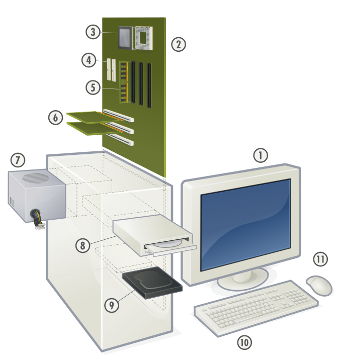

```{r setup, include=FALSE}
knitr::opts_chunk$set(echo = FALSE)
```

## Computadoras

Una computadora es una máquina que puede ejecutar **automáticamente** secuencias de **cálculos** y de **operaciones lógicas**. Estas secuencias son denominadas **programas**.

Algunas de las principales características de las computadoras modernas son:

- Son electrónicas.
- Son digitales.
- Son binarias.
- Son **programables**.

## Computadoras (cont.)

- En las computadoras modernas, es posible cambiar los programas que ejecutan sin necesidad de alterar sus componentes físicos.
- Los programas pueden desarrollarse con fines muy diversos, lo que le da a las computadoras una gran versatilidad con respecto a otras máquinas que solamente realizan tareas predefinidas (ej. calculadoras).

## Máquinas de cálculo {.flexbox .vcenter}

{width=400px}

_"Es indigno de hombres excelentes perder horas como esclavos en el trabajo del cálculo, porque si se usaran máquinas, podría delegarse con seguridad a cualquier persona"_ (Gottfried Leibniz).


## Primera computadora programable {.flexbox .vcenter}

{width=400px}


## Computadoras digitales {.flexbox .vcenter}

{width=600px}


## Arquitectura de computadoras {.flexbox .vcenter}

{width=500px}


## Componentes de hardware {.flexbox .vcenter}

{width=400px}


## Componentes de hardware (cont.)
1. Monitor
2. Tarjeta madre
3. Procesador o CPU
4. Puertos SATA
5. Memoria RAM
6. Ranuras de expansión
7. Fuente de alimentación
8. Unidad de disco óptico
9. Unidad de disco duro, Unidad de estado sólido
10. Teclado
11. Ratón


## Componentes de hardware y software
- El **CPU** realiza las operaciones lógicas y aritméticas.
- La **memoria RAM** almacena tanto los datos como los programas. Este almacenamiento es volátil.
- Los **discos** proporcionan un medio de almacenamiento permanente.
- Al conjunto de programas de una computadora, se le conoce como **software**.
    + **Sistemas operativos** (ej. UNIX, Linux, macOS, Windows, Android, iOS)
    + **Aplicaciones** (ej. procesadores de texto, hojas electrónicas, juegos de video, sistemas empresariales, sistemas de información geográfica)
    
    
## Lenguajes de programación
- Definen un conjunto de instrucciones para una computadora o CPU.
- Hay una gran [variedad de lenguajes de programación](https://en.wikipedia.org/wiki/List_of_programming_languages), para usos muy diversos (científicos, comerciales, educacionales, etc.).
- Tipos de lenguajes de programación:
    + **Lenguaje máquina**: es el lenguaje que puede ser directamente ejecutado por un CPU. Las instrucciones de lenguaje máquina acostumbran representarse mediante secuencias de ceros y unos (000001110110011....).
    + **Lenguajes de alto nivel**: son lenguajes en los que las [instrucciones se componen de palabras](http://helloworldcollection.de/) (usualmente en inglés) que son posteriormente traducidas a lenguaje máquina.
    
## Lenguajes de programación (cont.)
- El uso o la popularidad de los lenguajes de programación puede medirse mediante herramientas como el [índice Tiobe](https://www.tiobe.com/tiobe-index/) o la [encuesta de Stack Overflow](https://insights.stackoverflow.com/survey/2019#technology-_-programming-scripting-and-markup-languages).
- Algunos de los lenguajes que son importantes para el procesamiento de información geográfica son:
    + R
    + Python
    + SQL
    + JavaScript
    + Markdown
    + HTML/CSS